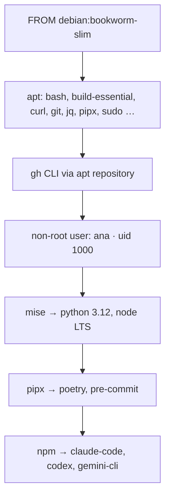
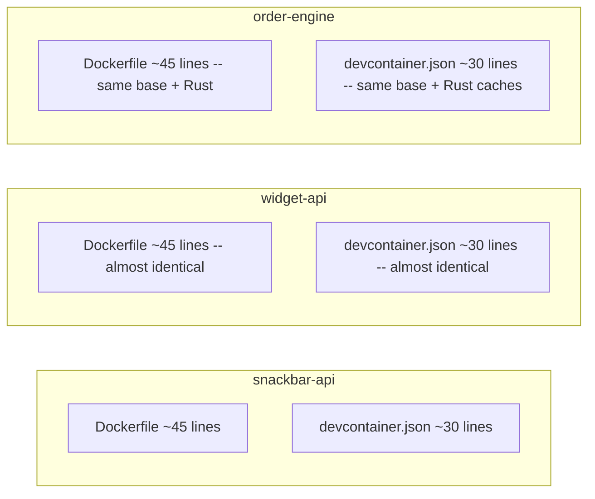
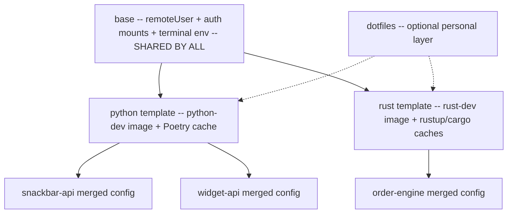
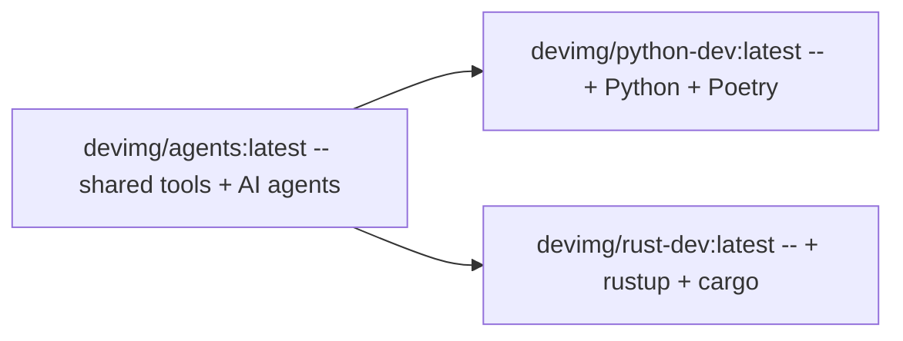

# Workflow Comparison: Docker vs Dev Containers vs dctl

## The scenario

Ana is a backend developer on a food-ordering platform. Her team is building `snackbar-api`, a Python API that lives at `~/projects/snackbar-api`, and they want every engineer to work inside isolated containers instead of leaking tooling into their host machines.

She also wants AI agents like Claude Code and Codex available inside the same container, shared setup across teammates, and rebuilds that do not turn into a ritual of Docker copy-paste. The comparison below shows what that workflow looks like with pure Docker, the Dev Container CLI, and `dctl`.

## TL;DR

| Task | `dctl` | Dev Container CLI | Docker |
| --- | --- | --- | --- |
| Set up a new Python workspace | `dctl deploy devcontainer python && dctl deploy image python-dev && dctl init --devcontainer python` | Write a `Dockerfile` + `.devcontainer/devcontainer.json` manually | Write a `Dockerfile` manually |
| Start the workspace | `dctl ws up` | `devcontainer up --workspace-folder . --config /path/to/devcontainer.json` | `docker run -it ...` |
| Scale to multiple projects | `dctl deploy ...` once, then `dctl init --devcontainer <name>` per project | Duplicate Dockerfile + JSON per project | Duplicate Dockerfile per project |
| Open a shell | `dctl ws shell` | `devcontainer exec --workspace-folder . bash` | `docker exec -it <container> bash` |
| Run an agent | `dctl ws shell claude` | `devcontainer exec --workspace-folder . bash -lic claude` | `docker exec -it <container> bash -lic claude` |
| Run a command | `dctl ws exec -- pytest` | `devcontainer exec --workspace-folder . pytest` | `docker exec -it <container> pytest` |
| Rebuild after config/image changes | `dctl ws reup` | `devcontainer up --workspace-folder . --remove-existing-container` | Rebuild image, remove container, rerun container |
| Build managed base images | `dctl image build --all` | No built-in global image build flow | Rebuild every project image separately |
| Stop and remove the workspace | `dctl ws down` | `docker ps -aq --filter "label=..." \| xargs docker rm -f` (no built-in command) | `docker stop <container> && docker rm <container>` |

*The rest of this document shows what those one-liners actually feel like in practice.*

## How to read this comparison

Each section below follows the same pattern: what Ana is trying to do, then the Docker version, the Dev Container CLI version, and the `dctl` version. The goal is not to prove that Docker or devcontainers are bad. The goal is to show how much manual setup and repetition each layer leaves behind.

Every section ends with a comparison table so the difference is not just qualitative. You can skim the tables, or read the commands line by line and decide which workflow you want to maintain across a team.

## Step 1: Set up a new Python workspace

**What Ana is trying to do:** prepare a container image for `snackbar-api` with Python, Poetry, dev tools, AI agent CLIs, and a non-root user — and define the setup commands that need to run every time a new container is created from that image.

Every approach starts with a Dockerfile that defines the image. But the Dockerfile only covers tools that can be installed at build time. Some setup depends on the mounted workspace — for example, `pre-commit install` needs the repo's `.pre-commit-config.yaml`, and `poetry install` needs `pyproject.toml`. Each approach handles this post-create setup differently.

### Docker

Ana writes a Dockerfile from scratch — around 45 lines covering everything from OS packages to AI agent CLIs:

```
snackbar-api/
└── Dockerfile          ← ~45 lines, committed to the repo
```



She builds it:

```bash
cd ~/projects/snackbar-api
docker buildx build --load -t snackbar-api-dev:latest .
```

This produces a local image tagged `snackbar-api-dev:latest`.

**Where it lives:** `~/projects/snackbar-api/Dockerfile`, committed to the repo.

**How the team shares it:** everyone clones the repo and builds locally. If the team has a second project (`widget-api`), that repo gets its own copy of the Dockerfile. Over time, the two copies drift.

The Dockerfile handles tool installation, but workspace-dependent setup like `pre-commit install` cannot be baked into the image — it needs the repo's `.pre-commit-config.yaml` to be present at runtime. With pure Docker, there is no built-in post-create hook. Ana has two options:

1. Remember to run setup commands manually after every `docker run`:

```bash
docker exec -it snackbar-api-dev bash -lc "pre-commit install"
```

2. Write an entrypoint script that runs the setup before `sleep infinity`, save it in the repo, and reference it in the Dockerfile. This is more work and more files to maintain.

Either way, Ana owns this problem herself.

Pain points:

- Ana authored ~45 lines of Dockerfile from scratch.
- Every project in the team needs its own copy — no shared base, no reuse across repos.
- When the team wants to add a tool (say a new AI agent CLI), every project's Dockerfile needs a manual update.
- Workspace-dependent setup (pre-commit, poetry install, etc.) has no built-in hook — Ana must remember to run it manually or write a custom entrypoint script.

### Dev Container CLI

Ana needs the exact same Dockerfile — devcontainers do not remove the image problem. She writes the same ~45-line file, saves it at `~/projects/snackbar-api/Dockerfile`, and builds `snackbar-api-dev:latest` exactly as in the Docker section above.

On top of that, she writes a `devcontainer.json` that tells the Dev Container CLI which image to use and how to configure the container. At this stage the JSON is minimal — it references the image she just built and sets the basics:

```bash
mkdir -p .devcontainer
cat > .devcontainer/devcontainer.json <<'EOF'
{
  "name": "snackbar-api",
  "image": "snackbar-api-dev:latest",
  "remoteUser": "ana",
  "workspaceFolder": "/workspaces/snackbar-api",
  "postCreateCommand": {
    "pre-commit": "pre-commit install"
  }
}
EOF
```

The `"image"` field points to the `snackbar-api-dev:latest` tag she built in the previous step. If that image does not exist locally, `devcontainer up` will fail.

The `"postCreateCommand"` solves the post-create setup problem that Docker has no answer for: `pre-commit install` runs automatically every time the container is created, without Ana having to remember or type it. She can add more commands here — `poetry install`, database migrations, anything that depends on the mounted workspace.

Mounts, env vars, and volumes are added to this file in Step 2 when she configures the runtime.

**Where it lives:** The Dockerfile at `~/projects/snackbar-api/Dockerfile` and the devcontainer config at `~/projects/snackbar-api/.devcontainer/devcontainer.json`. Both committed to the repo.

**How the team shares it:** same as Docker — clone and build. Teammates also get the devcontainer.json, but each project needs its own copy of both files.

What it solves over Docker:

- The container configuration is now declarative — `remoteUser`, `workspaceFolder`, and other settings live in a file instead of CLI flags.
- `postCreateCommand` gives Ana a built-in hook for workspace-dependent setup. No manual `docker exec` after every container creation, no custom entrypoint scripts.
- Editors and tools that support the devcontainer spec (VS Code, JetBrains, GitHub Codespaces) can consume this config directly.

What pain remains:

- Ana still wrote the same Dockerfile from scratch — devcontainers do not solve the image problem.
- Now she has **two** manual files per project instead of one: the Dockerfile and the `devcontainer.json`.
- Both files are per-project with no sharing or layering across repos.

### dctl

Ana runs one command:

```bash
cd ~/projects/snackbar-api
dctl deploy devcontainer python
dctl deploy image python-dev
dctl init --devcontainer python
```

This does three things:

**1. Deploys a managed Dockerfile** to `~/.config/dctl/images/python-dev/Dockerfile`. This is the equivalent of the ~45-line Dockerfile Ana wrote by hand in the Docker section — it comes pre-configured with Python, Poetry, Node LTS, gh CLI, Claude Code, Codex, Gemini CLI, pre-commit, and a non-root user. It is ready to build as-is, but Ana can open and edit it at any time:

```bash
$EDITOR ~/.config/dctl/images/python-dev/Dockerfile
```

**2. Deploys devcontainer config** to `~/.config/dctl/devcontainer/`. This includes a YAML manifest (`python.yaml`) declaring the ordered layer list, plus the referenced layer directories (the shared `base` layer and the `python` leaf layer). Together they serve the same role as the `devcontainer.json` Ana wrote by hand — image reference, `remoteUser`, and workspace-dependent setup hooks. The Python leaf layer comes with `pre-commit install` as a `postCreateCommand` out of the box, and Ana can add more (like `poetry install`) by editing the leaf config. She can inspect and customize it:

```bash
$EDITOR ~/.config/dctl/devcontainer/python/devcontainer.json
```

**Where it lives:** The Dockerfile at `~/.config/dctl/images/python-dev/Dockerfile` and the config layers under `~/.config/dctl/devcontainer/`. These are user-level files, not per-project — the same Dockerfile and config are reused across every Python workspace Ana creates.

**3. Registers the current project** by merging the deployed layers into `~/.cache/dctl/devcontainer/python/devcontainer.json`, auto-building the managed image if needed, and writing the cache path to `~/.config/dctl/projects.yaml`.

**How the team shares it:** `dctl` ships the defaults. Every teammate runs `make install`, `dctl deploy ...`, and then `dctl init --devcontainer python` inside each project. No Dockerfile to copy between repos, no per-project config to keep in sync. When the team adds a tool to the image, they update the shared Dockerfile in one place and every project picks it up on the next `dctl deploy image ...` plus `dctl image build`.

| | Docker | Dev Container CLI | dctl |
|---|---|---|---|
| Manual files to write | 1 Dockerfile (~45 lines) | 1 Dockerfile + 1 JSON config | 0 |
| Build commands | 1 (`docker buildx build`) | 1 (`docker buildx build`) | 0 (deferred to `dctl image build`) |
| Post-create setup | Manual — `docker exec` or custom entrypoint | Declarative — `postCreateCommand` in JSON | Pre-configured in deployed config |
| Per-project duplication | Yes — each repo gets its own Dockerfile | Yes — each repo gets both files | No — shared across workspaces |
| Team onboarding | Clone repo, write/copy Dockerfile, build | Clone repo, write/copy both files, build | `make install && dctl deploy ... && dctl init --devcontainer python` |

## Step 2: Start the workspace

**What Ana is trying to do:** launch the container with the project mounted, credentials available, and terminal env forwarded.

In Step 1 Ana prepared the image. Now she needs to configure the runtime: which directories to mount into the container, which env vars to forward, which volumes to persist. With Docker this is all CLI flags typed at run time. With devcontainers it is declared in the `devcontainer.json` file. With `dctl` it is already in the deployed config.

### Docker

Ana runs a `docker run` command that specifies every mount, env var, and runtime option by hand:

```bash
docker run -d \
  --name snackbar-api-dev \
  --hostname snackbar-api-dev \
  --workdir /workspaces/snackbar-api \
  -v "$HOME/projects/snackbar-api:/workspaces/snackbar-api" \
  -v "$HOME/.gitconfig:/home/ana/.gitconfig:ro" \
  -v "$HOME/.config/gh:/home/ana/.config/gh" \
  -v "$HOME/.config/glab-cli:/home/ana/.config/glab-cli" \
  -v "$HOME/.claude:/home/ana/.claude" \
  -v "$HOME/.claude.json:/home/ana/.claude.json" \
  -v /tmp:/tmp \
  -e TERM="${TERM}" \
  -e COLORTERM="${COLORTERM:-truecolor}" \
  -e GH_TOKEN="$(gh auth token)" \
  -e GITLAB_TOKEN="$(glab auth status --show-token 2>/dev/null | sed -n 's/.*Token: //p' | head -n1)" \
  snackbar-api-dev:latest \
  bash -lc "sleep infinity"
```

This command is not saved anywhere. It lives in shell history or a helper script that Ana maintains alongside the Dockerfile.

Docker has no post-create hook, so Ana also has to remember to run setup commands manually after the container starts:

```bash
docker exec -it snackbar-api-dev bash -lc "pre-commit install"
```

Every time she recreates the container, she has to run this again.

Pain points:

- 15+ lines. One typo in a mount path and the container starts with broken state.
- Ana must know which host paths matter (`.gitconfig`, `.config/gh`, `.claude`, etc.) and spell them all out.
- Credential forwarding is manual — she extracts `GH_TOKEN` via `$(gh auth token)` and `GITLAB_TOKEN` via a `glab` + `sed` pipeline. If she forgets, git and agent operations fail silently inside the container.
- The `sleep infinity` keepalive is a hack she now owns.
- There is no post-create hook — setup commands like `pre-commit install` must be run manually after every container creation.
- Any change to a mount or env var means stop the container, remove it, and re-type the entire command.

### Dev Container CLI

Before starting, Ana adds the runtime configuration to the `devcontainer.json` she created in Step 1 — mounts for credentials and cache, env vars for terminal and tokens, same things that Docker forced her to type as CLI flags. Here is the full file:

```json
{
  "name": "snackbar-api",
  "image": "snackbar-api-dev:latest",
  "remoteUser": "ana",
  "workspaceFolder": "/workspaces/snackbar-api",
  "containerEnv": {
    "TERM": "${localEnv:TERM}",
    "COLORTERM": "${localEnv:COLORTERM}"
  },
  "mounts": [
    "source=${localEnv:HOME}/.gitconfig,target=/home/ana/.gitconfig,type=bind,readonly",
    "source=${localEnv:HOME}/.config/gh,target=/home/ana/.config/gh,type=bind",
    "source=${localEnv:HOME}/.config/glab-cli,target=/home/ana/.config/glab-cli,type=bind",
    "source=${localEnv:HOME}/.claude,target=/home/ana/.claude,type=bind",
    "source=${localEnv:HOME}/.claude.json,target=/home/ana/.claude.json,type=bind",
    "source=/tmp,target=/tmp,type=bind"
  ],
  "remoteEnv": {
    "GH_TOKEN": "${localEnv:GH_TOKEN}",
    "GITLAB_TOKEN": "${localEnv:GITLAB_TOKEN}"
  },
  "postCreateCommand": {
    "pre-commit": "pre-commit install"
  }
}
```

Then she starts:

```bash
devcontainer up --workspace-folder ~/projects/snackbar-api
```

What it solves over Docker:

- All 15 lines of `docker run` flags are now declared once in a file. Ana types them once and never again.
- The file is committed to the repo — teammates get the same mounts, env vars, and hooks.
- `devcontainer up` handles container creation, volume setup, and the `postCreateCommand` automatically.

What pain remains:

- Ana had to learn the devcontainer.json schema — mount syntax, `localEnv` variable interpolation, `remoteEnv` vs `containerEnv`.
- This config is per-project. Her next repo needs a copy with the same mounts and env vars.
- `--workspace-folder` is required on every `devcontainer` command.
- Token forwarding via `${localEnv:GH_TOKEN}` requires Ana to have `GH_TOKEN` already set as a host env var. She still runs `export GH_TOKEN=$(gh auth token)` before starting, or it is empty.

### dctl

```bash
cd ~/projects/snackbar-api
dctl ws up
```

The config deployed in Step 1 and registered in Step 2 already includes all the runtime configuration that Docker required as CLI flags and Dev Container CLI required as manual JSON:

- **Mounts:** `.gitconfig` (read-only), `~/.config/gh`, `~/.config/glab-cli`, `~/.claude`, `~/.claude.json`, `/tmp` — all from the shared base config. The Poetry cache volume comes from the Python template.
- **Env vars:** `TERM` and `COLORTERM` are set in the base config.
- **Hooks:** `pre-commit install` is configured in the Python template.
- **Worktrees:** `dctl ws up` automatically detects and mounts the git worktree common directory when Ana works from a linked worktree.
- **Container identity:** keyed to the workspace path, so `~/projects/snackbar-api.fix-auth` would get its own isolated container automatically.

Ana did not write any of this. It came from the deployed defaults, and she can customize any of it by editing the config files under `~/.config/dctl/devcontainer/`.

| | Docker | Dev Container CLI | dctl |
|---|---|---|---|
| Runtime config location | CLI flags (re-typed every run) | `devcontainer.json` (declared once) | Pre-deployed config (already done) |
| Commands to start | 2 (volume create + 15-line `docker run`) + manual setup commands | 1 (`devcontainer up`) | 1 (`dctl ws up`) |
| Post-create hooks | None — manual `docker exec` after every creation | `postCreateCommand` in JSON | Pre-configured in deployed config |
| Credential forwarding | Manual `$(gh auth token)` extraction | Manual `${localEnv:GH_TOKEN}` + host export | Automatic at exec time (gh/glab; silently skipped if unavailable) |
| Config reuse across projects | None | None — per-project JSON | Shared across all workspaces |

## Step 3: Scale to multiple projects

Ana's team grows. Besides `snackbar-api`, she now also maintains `~/projects/widget-api` (another Python API) and `~/projects/order-engine` (a Rust service). All three projects need the same base setup: dev tools, AI agent CLIs, git auth, terminal env. The two Python projects share Python/Poetry. The Rust project needs rustup and cargo instead. The question becomes: how does each approach handle shared configuration across multiple projects?

### Docker

Ana now maintains three Dockerfiles:

- `~/projects/snackbar-api/Dockerfile` — the ~45-line file from Step 1
- `~/projects/widget-api/Dockerfile` — a near-identical copy
- `~/projects/order-engine/Dockerfile` — same ~30-line base but replaces Python/Poetry with Rust toolchain

She does not get to factor the overlap out anywhere. The base portion — apt packages, gh CLI, mise, user setup, AI agent CLIs — is copy-pasted into all three files. The Python portion — Python via mise, Poetry, pre-commit — is duplicated in two of the three. Only the Rust-specific lines for rustup and cargo differ in the third.

But Dockerfiles are only half the problem. Ana also has to maintain three separate `docker run` commands (or wrapper scripts), each with project-specific mounts, volumes, and env vars:

```bash
# snackbar-api: Python project
docker run -d --name snackbar-api-dev \
  -v "$HOME/projects/snackbar-api:/workspaces/snackbar-api" \
  -v "$HOME/.gitconfig:/home/ana/.gitconfig:ro" \
  -v "$HOME/.config/gh:/home/ana/.config/gh" \
  # ... same 6 shared mounts ... same env vars ...
  snackbar-api-dev:latest bash -lc "sleep infinity"
docker exec -it snackbar-api-dev bash -lc "pre-commit install"

# widget-api: another Python project — nearly identical command
docker run -d --name widget-api-dev \
  -v "$HOME/projects/widget-api:/workspaces/widget-api" \
  # ... same 6 shared mounts ... same env vars ...
  widget-api-dev:latest bash -lc "sleep infinity"
docker exec -it widget-api-dev bash -lc "pre-commit install"

# order-engine: Rust project — same base mounts, different caches and hooks
docker run -d --name order-engine-dev \
  -v "$HOME/projects/order-engine:/workspaces/order-engine" \
  -v "engine-rustup-ana:/home/ana/.rustup" \
  -v "engine-cargo-registry-ana:/home/ana/.cargo/registry" \
  -v "engine-cargo-git-ana:/home/ana/.cargo/git" \
  # ... same 6 shared mounts ... same env vars ...
  order-engine-dev:latest bash -lc "sleep infinity"
docker exec -it order-engine-dev bash -lc "cargo build && pre-commit install"
```

Each command repeats the same shared mounts and env vars. Each project needs its own manual post-create `docker exec` for setup hooks — and Ana must remember the correct hooks for each project type (Python gets `pre-commit install`, Rust gets `cargo build && pre-commit install`).

Pain points:

- 3 Dockerfiles with ~80% overlap.
- 3 `docker run` commands (or wrapper scripts) repeating the same shared mounts and env vars.
- 3 manual `docker exec` post-create hooks — different per project type, easy to forget.
- When the team adds a tool, 3 Dockerfiles need updating.
- When the team adds a shared mount, 3 run commands/scripts need updating.
- When someone fixes a bug in the base, they must propagate to all repos manually.
- The two Python Dockerfiles and run commands will drift over time.

### Dev Container CLI

Ana still has the same 3 Dockerfiles, plus she now has 3 `devcontainer.json` files — one per repo. The devcontainer.json solves the `docker run` and post-create hook problems from the Docker approach (mounts and hooks are declarative), but introduces a new problem: config duplication across repos.

Here is what Ana's file tree looks like across the three projects:



Each `devcontainer.json` repeats the same ~25-line base block from Step 2. Here is what the shared portion looks like — this block is copy-pasted identically into all three files:

```json
{
  "remoteUser": "ana",
  "workspaceFolder": "/workspaces/...",
  "containerEnv": {
    "TERM": "${localEnv:TERM}",
    "COLORTERM": "${localEnv:COLORTERM}"
  },
  "mounts": [
    "source=${localEnv:HOME}/.gitconfig,target=/home/ana/.gitconfig,type=bind,readonly",
    "source=${localEnv:HOME}/.config/gh,target=/home/ana/.config/gh,type=bind",
    "source=${localEnv:HOME}/.config/glab-cli,target=/home/ana/.config/glab-cli,type=bind",
    "source=${localEnv:HOME}/.claude,target=/home/ana/.claude,type=bind",
    "source=${localEnv:HOME}/.claude.json,target=/home/ana/.claude.json,type=bind",
    "source=/tmp,target=/tmp,type=bind"
  ],
  "remoteEnv": {
    "GH_TOKEN": "${localEnv:GH_TOKEN}",
    "GITLAB_TOKEN": "${localEnv:GITLAB_TOKEN}"
  }
}
```

Then each project adds its language-specific section on top of this shared block. The two Python projects both add `"pre-commit": "pre-commit install"`. The Rust project adds user-scoped cache volumes (`rustup-toolchains-<user>`, `cargo-registry-<user>`, `cargo-git-<user>`) and `"rust": "cargo build"` plus `"pre-commit": "pre-commit install"` to `postCreateCommand`.

The Python `devcontainer.json` files for `snackbar-api` and `widget-api` are almost identical — the only differences are the `"name"` field and the `"workspaceFolder"` path. Everything else is a copy.

What it solves over Docker:

- Mounts, env vars, and post-create hooks are declarative — no manual `docker run` flags or `docker exec` post-create commands.
- `devcontainer up` handles everything, and the config is committed to the repo so teammates get the same setup.

Pain points:

- 3 Dockerfiles + 3 devcontainer.json = **6 manual files** across 3 repos.
- The shared base block (~25 lines) is copy-pasted into every JSON. When Ana changes a mount, she updates 3 files.
- The Python-specific block is duplicated between `snackbar-api` and `widget-api`. When something changes, both files need updating.
- The devcontainer spec has no composition, inheritance, or layering — every project is a standalone config with no way to factor out shared settings.

### dctl

This is where the composable layer model pays off. Instead of duplicating config per repo, Ana reuses shared layers and selects the template that matches each project type.



The layers:

1. **`base/devcontainer.json`** is shared across all projects. It provides `remoteUser`, `containerEnv` (TERM, COLORTERM), and the shared mounts (`.gitconfig`, `.config/gh`, `.config/glab-cli`, `/tmp`). Ana edits this file once at `~/.config/dctl/devcontainer/base/devcontainer.json`, and every project inherits the change.

2. **Optional user layers** add personal config. For example, the [`examples/dotfiles/devcontainer.json`](../examples/dotfiles/devcontainer.json) shows editor mounts, dotfiles, and Kitty terminal vars. Ana adds a `dotfiles/` layer directory to `~/.config/dctl/devcontainer/` once and references it in her manifests — it applies to every project automatically.

3. **Project-type layers** add specifics on top of the shared layers:
   - `python/devcontainer.json` adds `image: "devimg/python-dev:latest"` and `postCreateCommand` with `pre-commit install`. Poetry cache is ephemeral (no volume).
   - `rust/devcontainer.json` adds `image: "devimg/rust-dev:latest"`, three user-scoped cache volumes (`rustup-toolchains-<user>`, `cargo-registry-<user>`, `cargo-git-<user>`), and `postCreateCommand` with `cargo build` plus `pre-commit install`.

4. **Image hierarchy:** `devimg/agents:latest` is the shared foundation. `devimg/python-dev:latest` and `devimg/rust-dev:latest` both build on top of it — so the image fleet mirrors the config layering.



Ana runs three commands for three projects:

```bash
cd ~/projects/snackbar-api && dctl init --devcontainer python
cd ~/projects/widget-api   && dctl init --devcontainer python
cd ~/projects/order-engine && dctl init --devcontainer rust
```

`dctl init` reads the YAML manifest for the selected config (e.g., `python.yaml` lists `layers: [base, python]`) and merges those layers in order into `~/.cache/dctl/devcontainer/<config>/devcontainer.json`. Both Python projects reuse the exact same deployed config layers and image. The Rust project uses a different manifest and image, but shares the same `base` layer.

When the team adds a new shared mount, Ana edits `base` once, runs `dctl init` in each project to refresh the cache, and every workspace picks up the change. No files to copy, no duplication to maintain.

| | Docker | Dev Container CLI | dctl |
|---|---|---|---|
| Files across 3 projects | 3 Dockerfiles + 3 run commands/scripts | 3 Dockerfiles + 3 JSON configs | 0 per-project files |
| Shared base config | None — duplicated in each Dockerfile | None — duplicated in each JSON | `base/devcontainer.json` (1 file, shared) |
| Add another Python project | Copy Dockerfile + build | Copy Dockerfile + JSON + build | `dctl init --devcontainer python` (reuses deployed config) |
| Add a Rust project | Write new Dockerfile from scratch | Write new Dockerfile + JSON from scratch | `dctl init --devcontainer rust` (reuses deployed config) |
| Post-create hooks across 3 projects | 3 manual `docker exec` commands (per project type) | Declarative in each JSON (but duplicated) | Pre-configured in shared templates |
| Change a shared mount | Update 3 `docker run` commands/scripts | Update 3 JSON files | Edit `base` once |
| Personal config (dotfiles, editor) | Add more `-v` flags per project | Duplicate in each JSON | Add a `dotfiles` layer once — applies everywhere |

## Step 4: Open a shell

**What Ana is trying to do:** jump into the running `snackbar-api` container without remembering container IDs or reconstructing how it was started.

### Docker

First Ana has to find the right container.

```text
$ docker ps
CONTAINER ID   IMAGE                  COMMAND                  NAMES
51fda4bb2e10   analytics-ui-dev       "bash -lc 'sleep inf…"   analytics-ui-dev
7c24d7c98a03   snackbar-api-dev       "bash -lc 'sleep inf…"   snackbar-api-dev
2c6ae0e3447e   rust-sandbox           "bash -lc 'sleep inf…"   rust-sandbox
```

Then she opens the shell.

```bash
docker exec -it snackbar-api-dev bash
```

Pain points:

- If she did not assign a nice container name up front, this becomes ID hunting.
- With multiple containers running, `docker ps` turns into visual scanning.
- Docker does not automatically forward terminal env like `TERM_PROGRAM` or Kitty vars on exec.

### Dev Container CLI

```bash
devcontainer exec --workspace-folder ~/projects/snackbar-api bash
```

What it solves:

- The CLI targets the right container by workspace metadata instead of a manual name.
- Ana no longer needs to scan `docker ps` output.

What pain remains:

- The long `--workspace-folder` flag is still repeated every time.
- If config is not where the CLI expects, Ana still has to think about how it gets resolved.

### dctl

```bash
dctl ws shell
```

Benefits:

- `dctl` finds the container by workspace label.
- It forwards `TERM`, `COLORTERM`, `TERM_PROGRAM`, `TERM_PROGRAM_VERSION`, and Kitty-specific vars automatically.
- It also forwards `GH_TOKEN` and `GITLAB_TOKEN` automatically — extracted from `gh auth token` / `glab auth status` on the host. If either CLI is missing or not authenticated, that token is silently skipped (no errors, no prompts).

| | Docker | Dev Container CLI | dctl |
|---|---|---|---|
| Commands | 2 (`docker ps` + `docker exec`) | 1 (`devcontainer exec`) | 1 (`dctl ws shell`) |
| Container lookup | Manual — scan `docker ps` output | Automatic — by workspace label | Automatic — by workspace label |
| Terminal env forwarding | No | No | Yes (`TERM`, `COLORTERM`, Kitty vars) |
| Credential forwarding | No | No | Yes (`GH_TOKEN`, `GITLAB_TOKEN`; graceful fallback if CLIs are missing) |

## Step 5: Run an agent

**What Ana is trying to do:** launch Claude Code inside the running container so the agent sees the repo, the shared tools, and the same isolated environment as the rest of the team.

### Docker

```bash
docker exec -it snackbar-api-dev bash -lic claude
```

Pain points:

- Ana still needs the container name or ID first.
- `bash -lic` becomes another bit of ceremony she has to remember.
- If she forgot to mount `~/.claude` or `~/.claude.json` when the container started, the agent is missing state and config.

### Dev Container CLI

```bash
devcontainer exec --workspace-folder ~/projects/snackbar-api bash -lic claude
```

What it solves:

- The container lookup is automatic.
- The command runs in the devcontainer instead of relying on Ana to manage `docker exec` details.

What pain remains:

- The long flags never go away.
- Auth and agent-related mounts still depend on project-local config Ana wrote by hand.

### dctl

```bash
dctl ws shell claude
```

Benefits:

- The agent name is just the argument — no `bash -lic` ceremony.
- Auth mounts (`.claude`, `.claude.json`) are part of the default config deployed in Step 1.
- Tokens are forwarded automatically at exec time.
- Same pattern for any agent: `dctl ws shell codex`, `dctl ws shell gemini`.

| | Docker | Dev Container CLI | dctl |
|---|---|---|---|
| Commands | 1 (`docker exec`) + possible lookup | 1 (`devcontainer exec`) | 1 (`dctl ws shell claude`) |
| Requires `bash -lic` | Yes | Yes | No — handled internally |
| Auth mounts needed at start | Must have been configured in Step 2 | Must have been configured in Step 2 | Already in default config |

## Step 6: Run a command

**What Ana is trying to do:** run test commands in the container without opening an interactive shell first.

### Docker

```bash
docker exec -it snackbar-api-dev pytest -q
```

Pain points:

- The command still depends on knowing the container name.
- This is not a login shell, so PATH-sensitive tool setup can surprise you if the image or shell init expects login behavior.

### Dev Container CLI

```bash
devcontainer exec --workspace-folder ~/projects/snackbar-api pytest -q
```

What it solves:

- The target container is resolved for her.
- The command is shorter than a full `docker exec` workflow with a manual lookup.

What pain remains:

- Ana still repeats a long flag on every invocation.
- Credential and terminal forwarding still depend on manual config choices.

### dctl

```bash
dctl ws exec -- pytest -q
```

Benefits:

- The `--` separates `dctl` flags from the in-container command.
- Tokens and terminal vars are forwarded automatically.

| | Docker | Dev Container CLI | dctl |
|---|---|---|---|
| Commands | 1 (`docker exec`) | 1 (`devcontainer exec`) | 1 (`dctl ws exec`) |
| Requires container name/ID | Yes | No | No |
| Long flags on every call | No | Yes (`--workspace-folder`) | No |

## Step 7: Rebuild after config or image changes

**What Ana is trying to do:** change the environment and get a fresh container quickly after editing config or updating the image.

### Docker

Ana rebuilds the image, removes the old container, then reruns the full startup command.

```bash
docker buildx build --load -t snackbar-api-dev:latest .

docker rm -f snackbar-api-dev

docker run -d \
  --name snackbar-api-dev \
  --hostname snackbar-api-dev \
  --workdir /workspaces/snackbar-api \
  -v "$HOME/projects/snackbar-api:/workspaces/snackbar-api" \
  -v "$HOME/.gitconfig:/home/ana/.gitconfig:ro" \
  -v "$HOME/.config/gh:/home/ana/.config/gh" \
  -v "$HOME/.config/glab-cli:/home/ana/.config/glab-cli" \
  -v "$HOME/.claude:/home/ana/.claude" \
  -v "$HOME/.claude.json:/home/ana/.claude.json" \
  -v /tmp:/tmp \
  -e TERM="${TERM}" \
  -e COLORTERM="${COLORTERM:-truecolor}" \
  -e GH_TOKEN="$(gh auth token)" \
  -e GITLAB_TOKEN="$(glab auth status --show-token 2>/dev/null | sed -n 's/.*Token: //p' | head -n1)" \
  snackbar-api-dev:latest \
  bash -lc "sleep infinity"
```

Pain points:

- It is three operations every time.
- The long `docker run` must stay in sync with the original startup command.
- In practice, people either retype this from history or maintain a shell script next to every repo.

### Dev Container CLI

For a config-only change:

```bash
devcontainer up --workspace-folder ~/projects/snackbar-api --remove-existing-container
```

For an image change:

```bash
docker buildx build --load -t snackbar-api-dev:latest ~/projects/snackbar-api/
devcontainer up --workspace-folder ~/projects/snackbar-api --remove-existing-container
```

What it solves:

- Recreating the container is one CLI call once the config already exists.
- Ana does not have to rerun a raw `docker run` command by hand.

What pain remains:

- Image builds are still outside the Dev Container CLI.
- There is no built-in orchestration for rebuilding a family of managed images.

### dctl

For a config-only change:

```bash
dctl ws reup
```

For a config layer change:

```bash
dctl init
dctl ws reup
```

For an image change:

```bash
dctl image build
dctl ws reup
```

Benefits:

- `dctl ws reup` recreates the workspace container without repeating discovery flags.
- `dctl ws reup` does not regenerate the merged cache by itself.
- `dctl init` is the refresh step when Ana changed a composable config layer and needs the merged cache regenerated first.
- `dctl image build` covers the image side before the container recreation step.

| | Docker | Dev Container CLI | dctl |
|---|---|---|---|
| Config-only rebuild | 3 commands (build + rm + re-run 15 lines) | 1 command | 1 command (`dctl ws reup`) |
| Image rebuild | 3 commands (same) | 2 commands (build + recreate) | 2 commands (`dctl image build` + `dctl ws reup`) |
| Config layer change | N/A | N/A | 2 commands (`dctl init` + `dctl ws reup`) |
| Re-types runtime flags | Yes — full `docker run` every time | No | No |

## Step 8: Build managed base images

**What Ana is trying to do:** refresh the image fleet that powers multiple workspaces, not just one project container.

### Docker

```bash
docker buildx build --load -t devimg/agents:latest ~/dockerfiles/agents/
docker buildx build --load -t devimg/python-dev:latest ~/dockerfiles/python-dev/
docker buildx build --load -t devimg/rust-dev:latest ~/dockerfiles/rust-dev/
docker buildx build --load -t devimg/zig-dev:latest ~/dockerfiles/zig-dev/
```

Pain points:

- Ana has to know the dependency chain and build `agents` first.
- The number of commands grows with the number of managed images.
- Raw Docker gives her no global orchestration for the image set.

### Dev Container CLI

```bash
docker buildx build --load -t devimg/agents:latest ~/dockerfiles/agents/
docker buildx build --load -t devimg/python-dev:latest ~/dockerfiles/python-dev/
docker buildx build --load -t devimg/rust-dev:latest ~/dockerfiles/rust-dev/
docker buildx build --load -t devimg/zig-dev:latest ~/dockerfiles/zig-dev/
```

What it solves:

- Very little for this particular problem. The Dev Container CLI is not an image fleet manager.
- `devcontainer build` can build one config, but it does not replace ordered image orchestration across multiple managed Dockerfiles.

What pain remains:

- The workflow is identical to raw Docker — Ana still runs the same build commands.
- She still owns the order, the targets, and the repetition.

### dctl

```bash
dctl image build --all
```

If Ana only needs one target:

```bash
dctl image build python-dev
```

Benefits:

- `dctl` builds from `~/.config/dctl/images/*/Dockerfile`.
- The dependency chain is handled for her.
- The command scales with the image fleet instead of getting longer as more images exist.

| | Docker | Dev Container CLI | dctl |
|---|---|---|---|
| Commands | N (one per image, manually ordered) | N (same as Docker) | 1 (`dctl image build --all`) |
| Build order | Manual — must know the dependency chain | Manual — same | Automatic |
| Dockerfile location | Scattered wherever the team put them | Same | Standardized at `~/.config/dctl/images/` |

## Step 9: Stop and remove the workspace

**What Ana is trying to do:** cleanly tear down the `snackbar-api` container when she is done, without guessing which resources are safe to remove.

### Docker

```bash
docker stop snackbar-api-dev && docker rm snackbar-api-dev

# Optional cleanup if she wants to reclaim space
docker image prune -f
```

Pain points:

- Ana still has to know the container name.
- Volumes persist silently unless she cleans them up herself.
- Dangling images accumulate over time unless someone remembers to prune.

### Dev Container CLI

`devcontainer stop` does not exist, so Ana falls back to raw Docker with a label filter.

```bash
docker ps -aq --filter "label=devcontainer.local_folder=$HOME/projects/snackbar-api" | xargs -r docker rm -f
```

What it solves:

- The label filter targets the workspace rather than a hand-remembered container name.

What pain remains:

- There is no built-in stop or down command in the Dev Container CLI for this workflow.
- Ana is back in raw Docker land anyway, just with a longer label expression.
- The label-filter fallback is arguably worse than just using a stable container name.

### dctl

```bash
dctl ws down
```

Benefits:

- `dctl` finds all workspace containers by label and removes them.
- The cleanup command matches the rest of the workspace lifecycle model.
- No ID hunting, no label-copying, no manual Docker fallback.

| | Docker | Dev Container CLI | dctl |
|---|---|---|---|
| Commands | 2 (`docker stop` + `docker rm`) + optional cleanup | 1 compound Docker command with label filter | 1 (`dctl ws down`) |
| Requires container name/ID | Yes | No (uses label filter) | No |
| Built-in CLI support | N/A | No — `devcontainer stop` does not exist | Yes |

## The full picture

| Step | Docker | Dev Container CLI | dctl |
|------|--------|-------------------|------|
| Setup (image) | 1 Dockerfile (~45 lines) + 1 build | Same Dockerfile + 1 build + 1 JSON file | 1 command, 0 manual files |
| Start (runtime config) | 2 commands, 15+ lines of flags | 1 command (but ~25 lines of manual JSON first) | 1 command |
| Scale (3 projects) | 3 Dockerfiles + 3 run commands + 3 manual hooks | 3 Dockerfiles + 3 JSON (duplicated) | 0 per-project files (shared base + templates) |
| Shell | 2 commands + visual scanning | 1 command (long flags) | 1 command |
| Agent | 1 command + possible lookup | 1 command (long flags) | 1 command |
| Run command | 1 command | 1 command (long flags) | 1 command |
| Rebuild | 3 commands (15+ lines re-typed) | 1-2 commands | 1-2 commands |
| Build images | N commands (manual order) | N commands (same) | 1 command |
| Teardown | 2+ commands + name lookup | 1 compound Docker command | 1 command |
| **Manual files** | **1 Dockerfile per project** | **1 Dockerfile + 1 JSON per project** | **0** |
| **Per-project duplication** | **Yes** | **Yes (both files)** | **No** |

`dctl` does not replace Docker or devcontainers — it builds on both. The value is in conventions: managed images, shared config, workspace-aware container identity, and automatic credential forwarding for GitHub (`gh`) and GitLab (`glab`) — with graceful degradation when either CLI is missing or unauthenticated. Ana writes zero boilerplate, and her teammates get the same setup with `make install && dctl init`.
